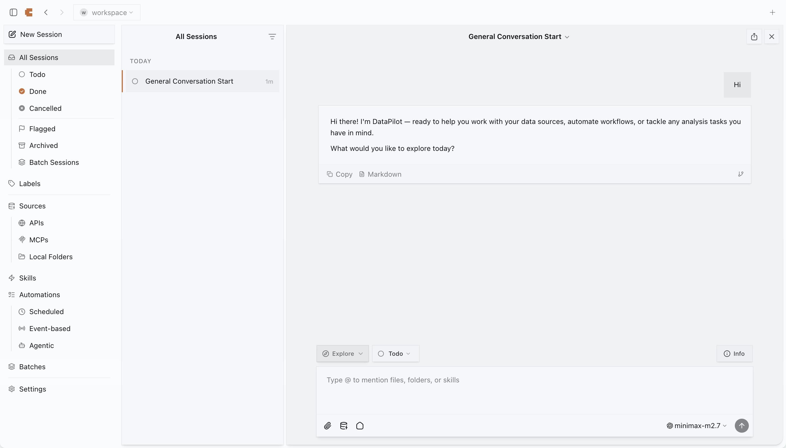

# DataPilot

[](LICENSE)

An open-source, agent-native workflow platform specialized for data analysis. Built on [Craft Agents](https://github.com/lukilabs/craft-agents-oss), DataPilot supports intuitive interaction with AI agents (Claude, GPT, Gemini, etc.), multi-session management, MCP service connections, custom skills, and document-centric workflows.



## Features

- **Multi-Session Inbox**: Desktop app with session management, status workflow, and flagging
- **Multiple LLM Providers**: Anthropic, Google AI Studio, ChatGPT Plus, GitHub Copilot, OpenRouter, Ollama, and more
- **Sources**: Connect to MCP servers, REST APIs (Google, Slack, Microsoft), and local filesystems
- **Skills**: Specialized agent instructions stored per-workspace
- **Automations**: Event-driven automation — trigger agent sessions on label changes, schedules, tool use, and more
- **Batches**: Process large lists of items from CSV/JSON/JSONL with configurable concurrency and retries
- **Permission Modes**: Three-level system (Explore, Ask to Edit, Auto) with customizable rules
- **File Attachments**: Drag-drop images, PDFs, Office documents with auto-conversion
- **Multi-File Diff**: VS Code-style window for viewing all file changes in a turn
- **Theme System**: Cascading themes at app and workspace levels
- **SQLite Storage**: Session data stored in SQLite (via Drizzle ORM) for performance and reliability

## Installation

### One-Line Install

**macOS / Linux:**
```bash
curl -fsSL https://raw.githubusercontent.com/i-richardwang/datapilot/main/scripts/install-app.sh | bash
```

**Windows (PowerShell):**
```powershell
irm https://raw.githubusercontent.com/i-richardwang/datapilot/main/scripts/install-app.ps1 | iex
```

### Download from Releases

Pre-built binaries for macOS (arm64/x64), Windows (x64), and Linux (x64) are available on the [Releases](https://github.com/i-richardwang/datapilot/releases) page.

### Build from Source

```bash
git clone https://github.com/i-richardwang/datapilot.git
cd datapilot
bun install
bun run electron:start
```

## Quick Start

1. **Launch the app** after installation
2. **Choose API Connection**: Use Anthropic (API key or Claude Max), Google AI Studio, ChatGPT Plus (Codex OAuth), or GitHub Copilot OAuth
3. **Create a workspace**: Set up a workspace to organize your sessions
4. **Connect sources** (optional): Add MCP servers, REST APIs, or local filesystems — or just ask the agent to set them up for you
5. **Start chatting**: Create sessions and interact with agents

## Remote Server (Headless)

DataPilot can run as a headless server on a remote machine, with the desktop app connecting as a thin client.

### Quick Start

```bash
DATAPILOT_SERVER_TOKEN=$(openssl rand -hex 32) bun run packages/server/src/index.ts
```

### Docker

```bash
docker run -d \
  -p 9100:9100 \
  -e DATAPILOT_SERVER_TOKEN=<token> \
  -e DATAPILOT_RPC_HOST=0.0.0.0 \
  -v datapilot-data:/home/craftagents/.datapilot \
  ghcr.io/i-richardwang/datapilot:latest
```

### One-Click Cloud Deploy

[](https://zeabur.com/templates/DATAPILOT)

### Environment Variables

| Variable | Required | Default | Description |
|----------|----------|---------|-------------|
| `DATAPILOT_SERVER_TOKEN` | Yes | — | Bearer token for client authentication |
| `DATAPILOT_RPC_HOST` | No | `127.0.0.1` | Bind address (`0.0.0.0` for remote access) |
| `DATAPILOT_RPC_PORT` | No | `9100` | Bind port |
| `DATAPILOT_RPC_TLS_CERT` | No | — | Path to PEM certificate file (enables `wss://`) |
| `DATAPILOT_RPC_TLS_KEY` | No | — | Path to PEM private key file |

### Connecting the Desktop App

```bash
DATAPILOT_SERVER_URL=wss://your-server:9100 DATAPILOT_SERVER_TOKEN=<token> bun run electron:start
```

## CLI Client

A terminal client for scripting, CI/CD pipelines, and command-line workflows.

```bash
# Self-contained run (spawns its own server)
datapilot-cli run "Summarize the README"
datapilot-cli run --workspace-dir ./my-project --source github "List open PRs"

# Multi-provider support
datapilot-cli run --provider openai --model gpt-4o "Summarize this repo"
datapilot-cli run --provider google --model gemini-2.0-flash "Hello"

# Connect to a running server
export DATAPILOT_SERVER_URL=ws://127.0.0.1:9100
export DATAPILOT_SERVER_TOKEN=<token>
datapilot-cli sessions
datapilot-cli send <session-id> "What files changed today?"
```

See `datapilot-cli --help` for the full command reference.

## DataPilot CLI (Workspace Tool)

A local CLI tool (`datapilot`) for managing workspace entities directly from the terminal or from within agent sessions:

```bash
datapilot source list                    # List configured sources
datapilot skill get my-skill             # View a skill definition
datapilot label create --name "urgent"   # Create a label
datapilot batch list                     # List batch jobs
datapilot automation list                # List automations
datapilot batch status <id> --items      # Batch progress with item details
```

## Supported LLM Providers

| Provider | Auth |
|----------|------|
| **Anthropic** | API key or Claude Max/Pro OAuth |
| **Google AI Studio** | API key |
| **ChatGPT Plus / Pro** | Codex OAuth |
| **GitHub Copilot** | OAuth (device code) |
| **OpenRouter** | API key (access hundreds of models) |
| **Ollama** | Local (no API key needed) |
| **Any OpenAI-compatible** | API key + custom base URL |

## Development

```bash
# Hot reload development
bun run electron:dev

# Build and run
bun run electron:start

# Type checking
bun run typecheck:all

# Build distribution
bun run electron:dist:mac
```

## Architecture

```
datapilot/
├── apps/
│   ├── cli/                   # Terminal client (CLI)
│   ├── webui/                 # Web UI (thin client)
│   └── electron/              # Desktop GUI
│       └── src/
│           ├── main/          # Electron main process
│           ├── preload/       # Context bridge
│           └── renderer/      # React UI (Vite + shadcn)
└── packages/
    ├── core/                  # Shared types
    ├── shared/                # Business logic
    ├── server/                # Headless server
    ├── server-core/           # Server RPC handlers
    ├── craft-cli/             # Workspace CLI tool
    └── session-tools-core/    # Session tool framework
```

| Layer | Technology |
|-------|------------|
| Runtime | [Bun](https://bun.sh/) |
| AI | [Claude Agent SDK](https://www.npmjs.com/package/@anthropic-ai/claude-agent-sdk) + Pi SDK |
| Desktop | [Electron](https://www.electronjs.org/) + React |
| UI | [shadcn/ui](https://ui.shadcn.com/) + Tailwind CSS v4 |
| Database | SQLite (via Drizzle ORM) |
| Build | esbuild (main) + Vite (renderer) |

## Troubleshooting

Launch with debug logging:

```bash
# macOS
/Applications/DataPilot.app/Contents/MacOS/DataPilot --enable-logging

# Windows
& "$env:LOCALAPPDATA\Programs\datapilot\DataPilot.exe" --enable-logging

# Linux
./DataPilot.AppImage --enable-logging
```

## License

This project is licensed under the Apache License 2.0 — see the [LICENSE](LICENSE) file for details.

DataPilot is a derivative work based on [Craft Agents](https://github.com/lukilabs/craft-agents-oss), originally developed by [Craft Docs Ltd](https://craft.do). The original work is copyright 2026 Craft Docs Ltd. and licensed under the Apache License 2.0. See the [NOTICE](NOTICE) file for attribution details.

This project uses the [Claude Agent SDK](https://www.npmjs.com/package/@anthropic-ai/claude-agent-sdk), which is subject to [Anthropic's Commercial Terms of Service](https://www.anthropic.com/legal/commercial-terms).
